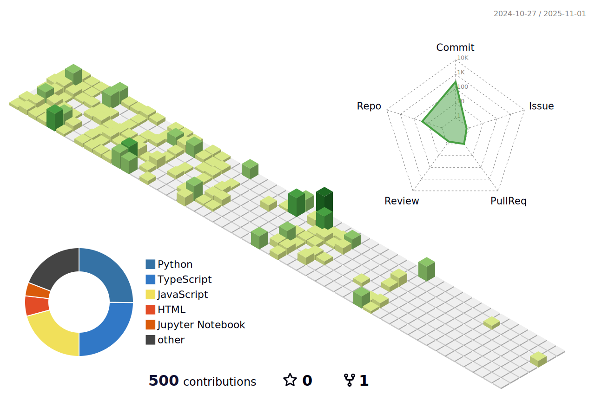

<h1 align="center">Hi there 👋, I'm Patrick</h1>

  
  
  

---

## 👨‍💻 About Me

- 🔭 I'm working on a fork of an open-source texas hold-em poker-solver and creating a next.js front-end to deploy, adding real-time solving as a feature.
- 🌱 I’m currently learning C#
- 📫 How to reach me: [pconnors@uwo.ca](mailto:pconnors@uwo.ca)
---

## 🚀 Languages & Tools

  
  
  
  
  
  
  
  
  
  
  
  
  
  
  
  
  
  
  
  
  
  

---

Made with ❤️ by Me

